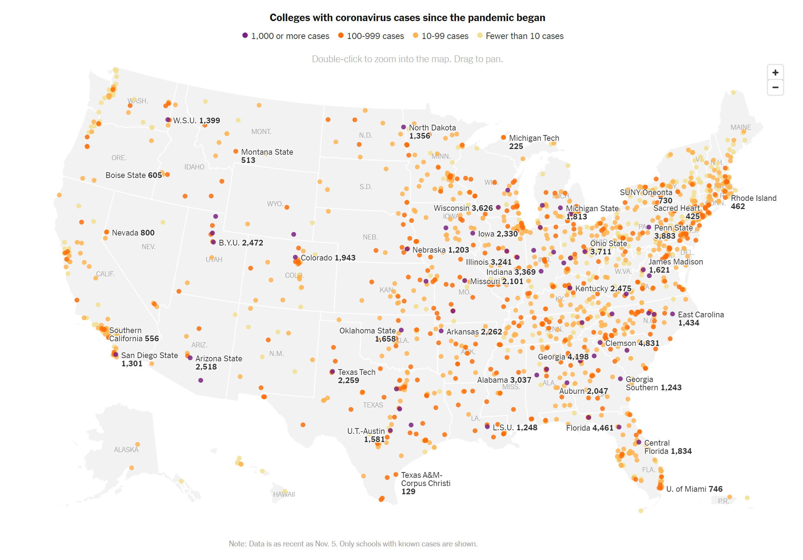
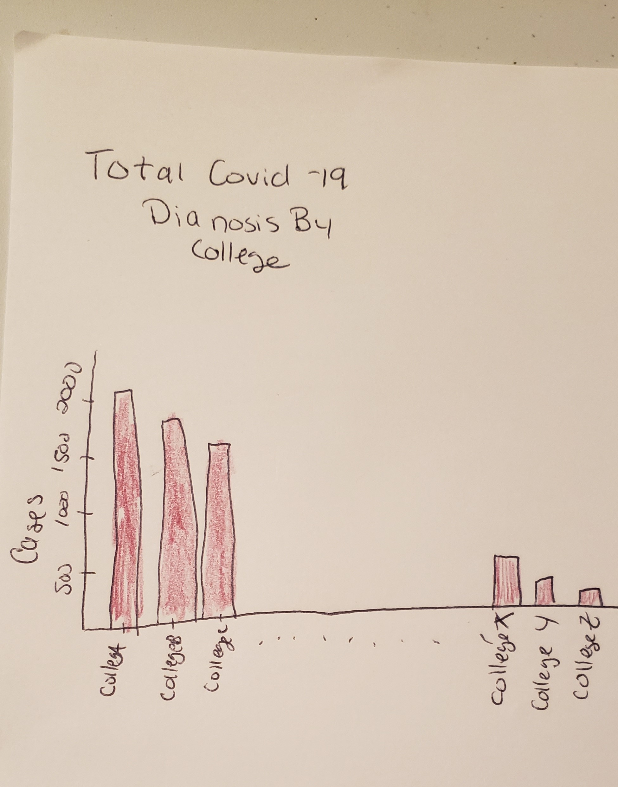
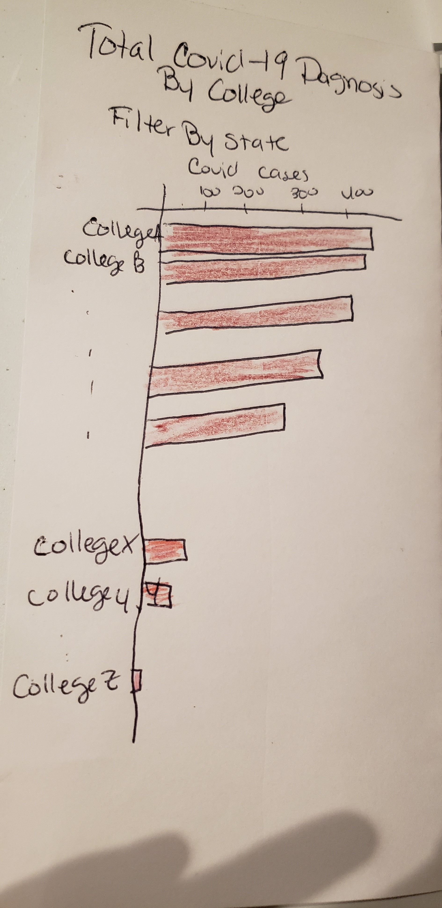

# Tracking the Coronavirus at U.S. Colleges and Universities, Critique of the New York Times
## Original Image

I chose this data visualization because I felt that it missed the mark on exploring this data in a meaningful way.  First, I'm not sure that it is necessary to display the information on a map.  It is also difficult to compare covid-19 cases across colleges because 1. the dots represent huge variations in case amounts and 2. are difficult to see in places with a color coding scheme that doesn't make sense for this type of data. 

From the critique I found that it wasn't clear what the visulaitation was trying to show.  I also discovered that it was difficult to gain any insight about case counts from the map.  I liked that the map set up the possibility for comparisons across schools, but it wasn't executed very well.

## Wireframes

 
 Through my interviews on my wireframes I found that it was ambigous what my message was and who my audience was.  The information being provided is just a list and is not curated in anyway and the people that I interviewed found it difficult to figure out where I was going with the visulaization.  One suggested I filter the data is some way to show something more interesting with the data.  The other suggested that I only use one hue for the visualation (it's difficult to tell, in the second photo there are three color categories) as it did not add extra value to the visualization.
 
 ## The Final Product

<iframe src="https://public.tableau.com/views/CollegeCampuseswith1000Covid-19CasesorMore/CollegeCampuseswith1000Covid-19CasesorMore?:showVizHome=no&:embed=true" width="90%" height="500" seamless frameborder="0" scrolling="no"></iframe>

Based on feedback from my interviews, I decided to pair down the data to just campuses that had 1,000 cases or greater.  My goal with this visulaization was to allow for people to compare overal case numbers easily between campuses and easily see which universities had the largest number of cases.  I also wanted to fucus on those campuses that were hit particularly hard as those are the campuses that may need to make some hard decisions in the weeks to come.

[Data](https://www.nytimes.com/interactive/2020/us/coronavirus-us-cases.html) from The New York Times, based on reports from state and local health agencies.”
