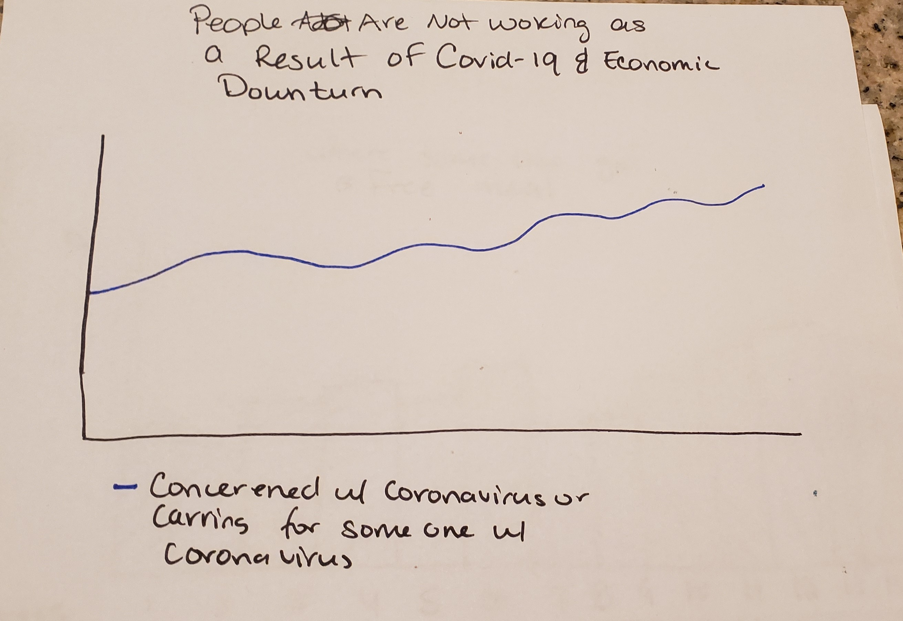
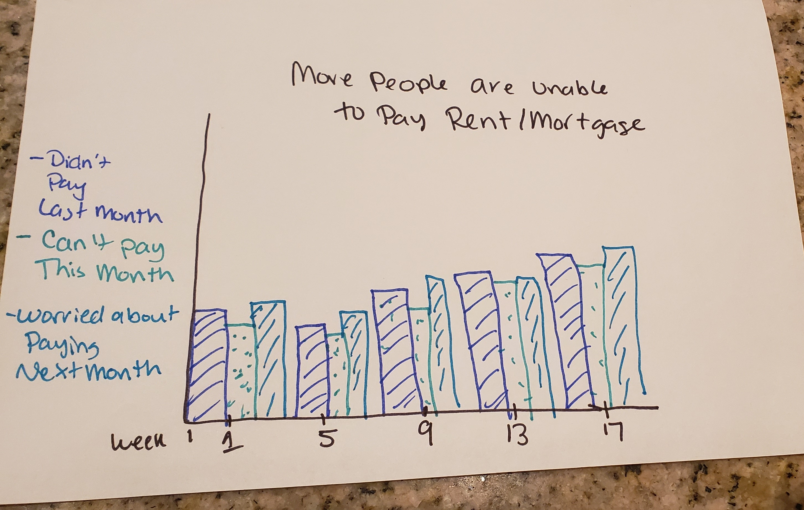
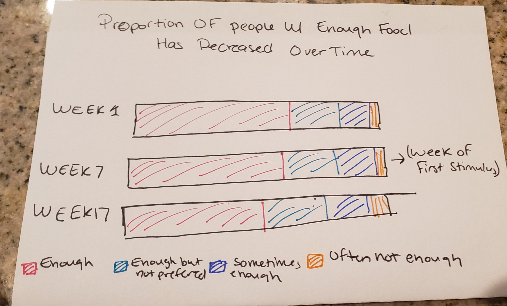
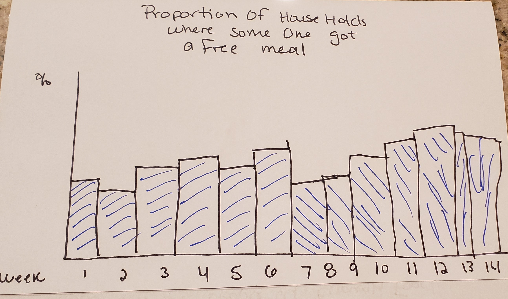
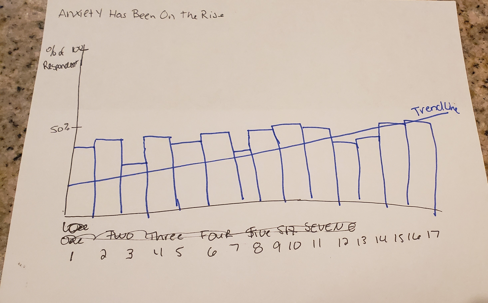

## Outline
### High Level Summary
The Covid-19 pandemic has affected American's in a varity of ways.  I plan on exploring how people's lives have been impacted by covid-19 through changing food security, employment, mental health, and housing.

### Story Arc
1. Intorduction to The Topic (Include note about initial stimulus)

2. People are Loosing Their Jobs or In Fear of Losing Their Jobs
  
  
3. People are Unable/Worried About Paying Their Rent or Mortgage
  
  
4. People are Becoming More Food Insecure

5. Anxiety is Increasing

6. Call to Action
  Contact Your Local Representative and Urge Them to Pass Another Covid Relief Bill 

## Data
https://www.census.gov/programs-surveys/household-pulse-survey/datasets.html

## Method and Medium
